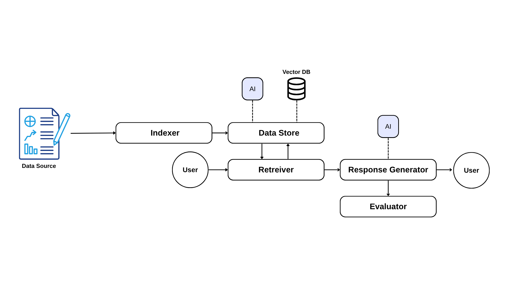

# RAG Project

This portfolio demonstrates a full Retrieval Augmented Generation (RAG) pipeline implemented end-to-end. It showcases document parsing and indexing, context retrieval, AI-driven response generation, and automated evaluation orchestrated through command-line interface.



## Overview

This project delivers a complete RAG pipeline that:

- **Ingests & Indexes:** Automatically splits source files (e.g., PDFs) into optimized chunks for retrieval.
- **Stores & Searches:** Persists vector embeddings in LanceDB and performs fast, similarity-based lookups.
- **Generates AI Responses:** Feeds retrieved context into an LLM (via the OpenAI API) to produce concise, accurate answers.
- **Evaluates Performance:** Compares outputs against expected Q&A pairs in bulk and exposes evaluation reasoning for deeper insights.

## Architecture

- **Core Pipeline (src/rag_pipeline.py)**  
  Acts as the central coordinator, chaining together:
  
  - **Vector Store:** Persists and retrieves document embeddings in LanceDB.  
  - **Chunker:** Splits source files into optimal segments; choose between a simple PDF splitter or the Docling-based implementation.  
  - **Retriever:** Executes similarity searches to fetch relevant chunks.  
  - **Answer Generator:** Sends the retrieved context to an LLM (via OpenAI) to craft responses.  
  - **Evaluator:** Compares generated answers against expected Q&A pairs in bulk, offering detailed performance insights.

- **Abstractions (interface/)**  
  Defines abstract base classes (e.g., `BaseVectorStore`, `BaseChunker`, `BaseRetriever`, `BaseAnswerGenerator`, `BaseEvaluator`) for easy extension and swapping of components.  

## Setup

### Create an Isolated Environment (Recommended)

```bash
python3 -m venv .venv
source .venv/bin/activate    # Windows: .venv\Scripts\activate.bat

```
#### Install Dependencies

```bash
pip install -r requirements.txt
```

#### Configure Environment Variables

This project uses the OpenAI API for language model calls (see `src/util/invoke_ai.py` if you need a different service). Before running any commands, export your key:

```bash
export OPENAI_API_KEY="your_openai_api_key"
```

#### Cohere Setup for Re-Ranking

To enable the optional re-ranking step in `src/impl/retriever.py`, export your Cohere API token. Sign up at https://cohere.com/ to generate a key:

```bash
export COHERE_API_KEY="your_cohere_api_key"
```

## Usage

Use CLI to perform indexing, querying, and evaluation tasks. By default, it reads from the paths set in `main.py`; you can override them with the `--source` and `--eval` flags as needed:

```bash
# Defaults defined in main.py
DEFAULT_SOURCE_PATH="sample_data/source/"
DEFAULT_EVAL_PATH="sample_data/eval/sample_questions.json"
```
#### Execute Complete Workflow

This command clears any existing embeddings, ingests and indexes all source documents, then runs the evaluation suite.

```bash
python main.py run
```
#### Reset the Vector Store

Removes all stored embeddings from the vector database.

```bash
python main.py reset
```

#### Add Documents

Import new files or folders into the vector store for embedding and indexing.

```bash
python main.py add --path "sample_data/source/"
```

#### Search Documents

Run a similarity search against the indexed embeddings using your query.

```bash
python main.py query "What is the opening year of The Lagoon Breeze Hotel?"
```

#### Evaluate Performance

Run batch tests using a JSON file of question/answer pairs to assess the AI’s accuracy and reasoning.

```bash
python main.py evaluate --file "sample_data/eval/sample_questions.json"
```
